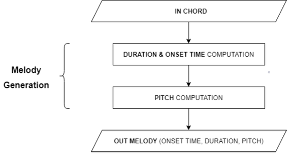
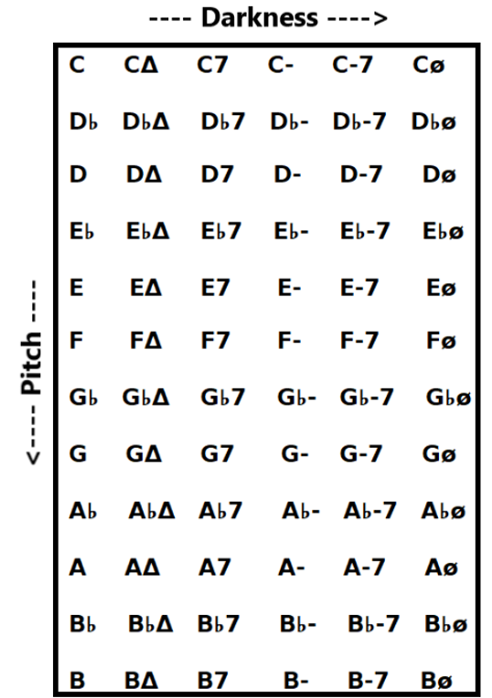
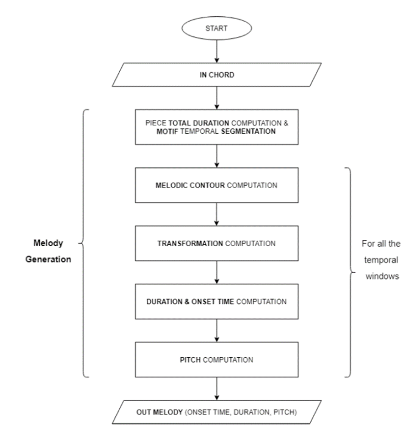
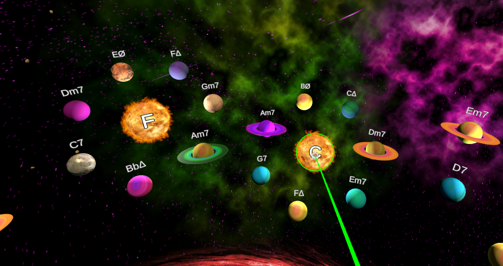
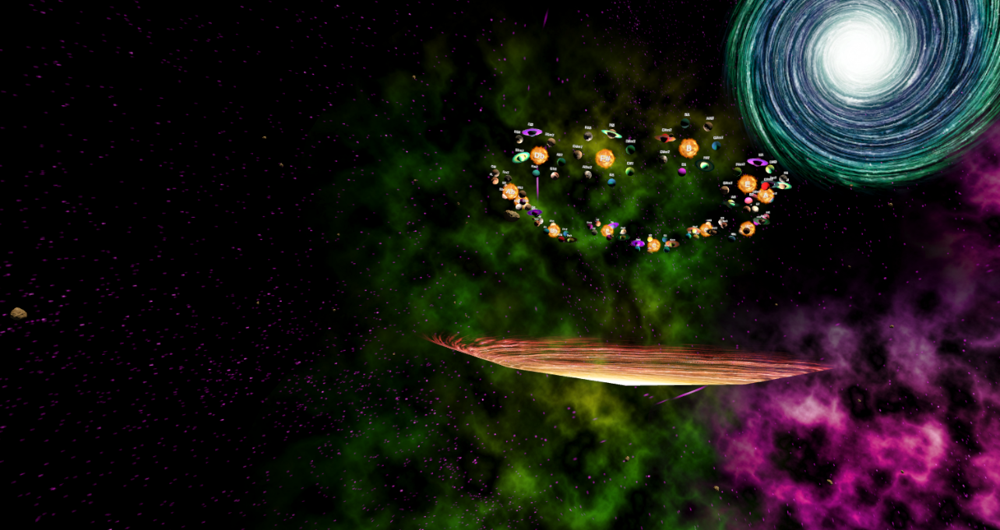

# Musica Universalis 

## Abstract

Inspired by the "Musica Universalis" or the "music of the spheres", our project aims to merge the realms of Interactive Art, Music and Philosophy. This ancient belief views the universe as an intricate symphony, governed by harmonious mathematical laws. Since these cosmic tunes are believed to be beyond human hearing, they challenge composers to emulate this celestial dance through their own musical pieces. Within this metaphysical and philosophical concept, music is generated stochastically using absorbing Markov chains, where the user is the composer! This Interactive Art work proposes an immersive journey through the universe in Virtual Reality (6DOF), aiming to bring the listener into a transcendent and impactful experience in the realm of stochastical composition. Additionally to this artistic purpose, this new visual approach offers music students a new interactive way to learn and practice the basics of tonal harmony.

## Background

Organizing musical information and developing algorithms for modeling music in general can be a very challenging task from a computational point of view. This is simply because a computer doesn't know what is music. In order to let a machine understand and generate sounds in an organized fashion, we need to teach what do we mean with "music" or "good-sounding" melodic lines. There are many approaches in literature which tackle this problem from different perspectives. One of the main technique used for this purpose, is based on the notion of grammars. Robert M. Keller et al. explain in their research (2007) [1] and (2010) [2], how probabilistic grammars can be used for the automatic generation of jazz solos and how the learning of such grammars can be carried out. In fact, the advantage of a grammar is that it's possible to replicate the style of a particular performer in generating new melodies. First off, an abstraction of the corpus of segments is performed in order to train the model and capture specific peculiarities, such as the _melodic contour_, the _reference scale_ or the _melodic range_. Different note categories are then introduced to support the abstract modelling and a grammar is finally used to instantiate probabilistically these categories to actual melodies. Abstract melodies are encoded in form of _S-expressions_ (which are strings obtained by the combination of different numbers and symbols associated to note categories), and they guarantee a certain degree of freedom when it comes to generating new melodic lines. 
In our opinion, since this approach encodes the role of the note within the melody, it could be considered either very functional or too formal. Another drawback of this approach could be the fact that it expresses leaps in terms of half-tones, while often we tend to use diatonic steps due to our "embedded" notion of diatonic scale (we think in terms of steps, rather than half-tones). For this reason, we decided to opt for the second option in our generative approach. Another major difference lies in the computation of the melodic contour, which is not entirely based on the notion of _slope_ (as performed in the _Impro-Visor_ software by Keller [3]), rather on the idea of _moving averages_, which lets us perform even more flexible detours during the phase of melody generation. Finally, in order to pick the best fitting scale, mode detection has been implemented which identifies the function of each chord in advance. 
Drawing inspiration from Keller's work, considered as a reference point, we have developed an original rule-based approach based on the stochastic generation of melodies through Markov chains, but implementing the classical harmony and musical counterpoint conventions instead of adhering to Jazz style. As mentioned before, the music will be represented in a spatial Virtual Reality environment, resembling the organization of the _circle of the fifths_.

## Melody Generator
The problem of generating melodic lines that are consistent with a given chord can be tackled from different perspectives. But in general, to generate music, the following parameters have to be defined for each note: _onset time_, _duration_ and _pitch_. We proceed separating the "temporal problem" from the "spatial problem". Since the generation of the pitches varies with respect to their position in time (due to musical constraints about _chords notes_ versus _passing notes_), we decided to first generate the temporal features of each note and then the pitches.
The flowchart in the following picture represents our approach on an high level of abstraction.

As mentioned before, the task of our pattern generator is to analyze a chord given as input and generate a melodic line as output using the best fitting modal scale. 
Let us recall that music, often defined as organized sound [4], is characterized by multiple events aimed at stimulating our perception. This process is two-dimensional. In fact, it develops both horizontally (sequentially) and vertically (synchronously). Harmony is the relationship that is established in parallel between several sounds. 
First off, to automatically analyze a chord and generate a good souding melody on top of it, it was necessary to define the input, choosing a set of chords consistent with a reference harmonic syntax (in our case the tonal harmony). Specifically, we decided to use the triads and quadriads obtained from the harmonization of the major scale which are the following: Major, Minor, Major7 (delta), Minor7, Dominant, Half-diminished (the approach could certainly be generalized to any type of chord). Here's the representation of the chords, ordered by pitch and _darkness_ :

Once we defined the input chords, the flowchart representing our approach on a lower level of abstraction can be conceptualized as follows:

The Musica_Universalis.scd file describes the whole process step by step. Each part of the code is deeply commented, explaining the approach in detail at its own core.

## Virtual Reality Environment and Representation
In concepting this new artistic representation, we proceeded to describe the theme, the motivation and the user experience. As the title "Musica Universalis" says, the theme derives from the theory of the music of the spheres, which originated in antiquity and continued to be followed at least until the 17th century, arousing the interest of philosophers, musicologists, and musicians. The strict analogy between the celestial harmony and musical harmony led us to represent musical chords as planets in a spatial environment. Each solar system represents a tonal center, with its seventh chords (build on each grade of the diatonic scale) represented as planets orbiting their own star. The twelve stars are displaced in circle, forming the so called "circle of fifths" (a peculiar way of organizing the 12 chromatic pitches as a sequence of perfect fifths). This intuitive representation resembles both the natural displacement of the planets and stars, and the logic behind the seventh chords orbitating their tonic. 
When the user selects a planet or a star, our _Melody Generator_ will create a random melody based on the selected chord (through OSC messages), based on the conventional rules of tonal harmony and counterpoint.
The motivation behind this representation is dual. First, we aim to explore a new way to provide an immersive experience to the user, in order to let him feel fully involved in the process of stochastic composition. But this is not just thought as a emotional experience, but also as a didactic tool for harmony students who can approach differently this topic, in an interactive and visual way.

## To run this project

Rquirements:
- SuperCollider (3.11.2)
- Unity 2022.3.9f1 and Unity Hub (3.5.2)
- MQDH (Meta Quest Developer Hub), (3.8.0)
- Meta Quest 2

To run this project:

1) Download and run SuperCollider
2) Open \SuperCollider\Musica_Universalis.scd
3) Select the whole code and run it (Shift+Enter)
4) Power on your Meta Quest 2 and connect it to your PC with the USB cable
5) On your Meta Quest 2, put your VR in Quest Link mode by clicking Settings > System > Quest Link > Run Quest Link
6) Open MQDH software and ensure that in Device Manager tab your Meta Quest 2 is properly connected
7) Download from \Unity musica_universalis.zip (Google Drive link) and unzip
8) Open Unity Hub and import the project by clicking Open and selecting the unzipped folder
9) Open the project and wait for loading all the components
10) Click _Play_ button and enjoy the experience in VR

## Other material

We use the following external dependencies:
- **XR Plugin Management** @4.4.0
Package that provides simple management of XR plug-ins. Manages and offers help with loading, initialization, settings, and build support for XR plug-ins.
- **TextMeshPro** @3.0.6
TextMeshPro is the ultimate text solution for Unity
- [**Oculus Integration**](https://assetstore.unity.com/packages/tools/integration/oculus-integration-82022) @4.0.0
Provides display and input support for Oculus devices.
- [**Vast Outer Space**](https://assetstore.unity.com/packages/3d/environments/sci-fi/vast-outer-space-38913) @1.0
This is a great modular outer space package for you to create your very own unique outer space environments.
- [**Quick Outline**](https://assetstore.unity.com/packages/tools/particles-effects/quick-outline-115488) @1.1
Quick Outline is a world-space outline tool, that adds a solid outline to any object.
- [**LeanTween**](https://assetstore.unity.com/packages/tools/animation/leantween-3595) @2.51
Moving game objects smoothly with ease in and out
- [**UnityOSC**](https://thomasfredericks.github.io/UnityOSC/) @1.0
Open Sound Control (OSC) integration for Unity

## References

[1] Robert M. Keller, David R. Morrison. A Grammatical Approach to Automatic Impro-
visation. Proceedings SMC'07, 4th Sound and Music Computing Conference, 11-13
July 2007, Lefkada, Greece. 

[2] Jon Gillick, Kevin Tang, Robert M. Keller. Machine Learning of Jazz Grammars.
Computer Music Journal 34(3):56-66, September 2010.

[3] Robert M. Keller, David Morrison, Stephen Jones, Belinda Thom, Aaron Wolin. A
Computational Framework Enhancing Jazz Creativity. Published 2006.

[4] Edgard Varese, Concepts of Organized Sound. Jan. 1982.
